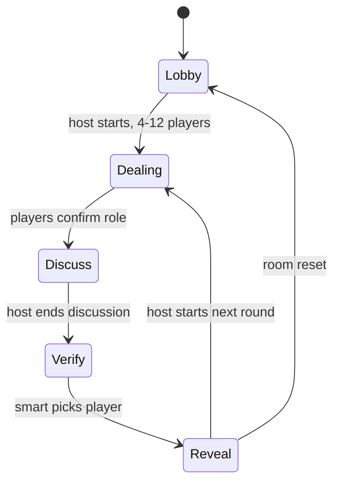

# 后端设计

## 目标

为“瞎掰王”提供实时房间、身份保密、房主权限、轮次推进、释义计时和记分结算能力。前端只负责展示和发起动作，关键规则由服务端裁决。

## 推荐技术方案

- Web 服务：Node.js + Fastify 或 NestJS。
- 实时通信：Socket.IO 或原生 WebSocket。
- 存储：Redis 保存实时房间状态，PostgreSQL 保存用户、词库、历史战绩和管理后台数据。
- 部署：前端静态站点 + 后端 API 服务；小规模 MVP 可以先用单 Node 服务和 Redis。

## 核心数据模型

### Room

- `code`：4 到 6 位房间号，建议正式版使用 6 位降低碰撞。
- `hostPlayerId`：房主玩家 ID。
- `status`：`lobby | dealing | discuss | verify | reveal`。
- `players`：玩家公开信息列表。
- `roundNo`：当前轮次。
- `currentWordId`：当前词条 ID。
- `currentWordDirections`：当前题目的 3 个候选方向，可公开。
- `createdAt`、`updatedAt`、`expiresAt`。

### Player

- `id`：服务端生成的玩家 ID。
- `sessionId`：连接或登录会话 ID。
- `nickname`。
- `avatarColor`。
- `score`。
- `connected`：是否在线。
- `isHost`：是否房主。

### Round

- `roomCode`。
- `roundNo`。
- `rolesByPlayerId`：仅服务端保存完整身份映射。
- `honestPlayerId`：可公开。
- `smartPlayerId`：只发给本人，揭晓后公开。
- `wordId`。
- `definitionViewedBy`：记录每位玩家是否查看过释义。
- `changedWordCount`：本轮换题次数，可用于后续限制。
- `pickedPlayerId`。
- `result`：`smart_honest | bull_win`。

### Word

- `id`。
- `word`。
- `pinyin`。
- `definition`。
- `directions`：3 个候选方向。
- `answer`：正确方向。
- `enabled`。
- `source`：`default | custom`。

## Socket 事件

### 客户端发起

- `room:create { nickname }`
- `room:join { code, nickname }`
- `room:leave`
- `room:kick { playerId }`
- `game:start`
- `round:ready`
- `definition:view`
- `word:change`
- `discussion:end`
- `verify:pick { playerId }`
- `round:next`

### 服务端广播

- `room:state`：公开房间状态，不包含非本人私密身份。
- `player:private_state`：只发给单个玩家，包含自己的身份、是否可看释义、释义内容或占位提示。
- `definition:timer`：释义查看剩余时间，也可以完全由客户端本地倒计时，服务端只记录开始时间。
- `round:revealed`：验证后公开所有身份、词义、得分变动。
- `error`：房间不存在、人数不足、无权限、房间已满、状态不允许等。

## 权限与规则校验

- 创建房间的人是房主；房主掉线后可设置短时间保留，超时转移给最早加入且在线的玩家。
- 开始游戏、请出玩家、结束讨论、下一轮只能由房主执行。
- 开局人数必须在 4 到 12 人之间。
- 身份分配必须由服务端完成，不能接受前端传入身份。
- 老实人的身份可在公开状态中展示；大聪明和瞎掰人只发送给本人。
- 释义查看只能触发一次；非老实人永远不能收到真实释义。
- 当前题目的 3 个候选方向可以广播给所有人，但正确方向只发给老实人，并在揭晓后公开。
- 换题只允许老实人在 `discuss` 阶段执行；服务端更换词条后应重置 `definitionViewedBy`。
- 验证只允许大聪明在 `verify` 阶段执行。
- 结算由服务端根据身份映射完成，不能接受前端传入得分。

## REST API

实时游戏优先走 Socket。REST 主要用于后台与辅助查询：

- `GET /health`
- `GET /words`
- `POST /admin/login`
- `POST /admin/words/import`
- `DELETE /admin/words/custom`
- `GET /rooms/:code/snapshot`：用于重连恢复，返回当前玩家可见状态。

## 状态流

## MVP 实现顺序

1. 接入真实房间创建、加入、离开和房主踢人。
2. 用 WebSocket 同步大厅玩家列表和房间状态。
3. 将发牌、词语选择、释义查看和验证结算迁到后端。
4. 增加题目方向与老实人换题事件，并记录换题次数。
5. 实现断线重连与房主转移。
6. 迁移词库管理后台，移除前端硬编码密码。
7. 增加简单的房间过期清理任务和日志。

## 安全注意事项

- 不向客户端广播完整 `rolesByPlayerId`。
- 管理员密码和词库写权限必须在服务端处理。
- 房间号需要限流，避免暴力枚举。
- Socket 事件需要校验当前连接是否属于该房间。
- 对昵称、词库导入文本做长度限制和转义，避免 UI 注入。
